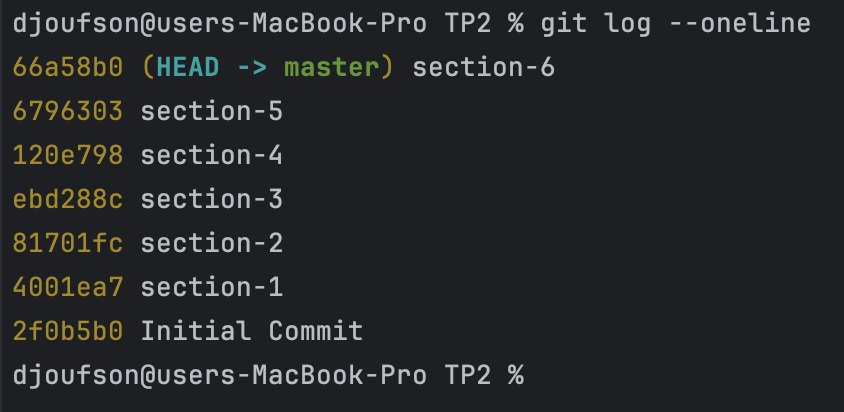

# TP2 formation dev Mobile
Ceci est le Travail Pratique N0 2 de la formation Kotlin de Google.

[Lien de la formation](https://developer.android.com/codelabs/android-development-kotlin-2.1?continue=https%3A%2F%2Fdeveloper.android.com%2Fcourses%2Fpathways%2Fandroid-development-with-kotlin-2%3Fhl%3Dfr#0)

---
# Comment suivre et run le projet?
Apres avoir cloné le projet, il est organisé en sections. Les sections précédentes sont commentées à chaque étape pour éviter la confusion, chaque section est associée à un commit.

## Exemple
Voici l'historique des commits:


Lorsque l'on voudra visiter la secion 1 qui correspond au commit `4001ea7` il suffira de taper la commande:

```shell
git checkout 4001ea7
```

Et pour revenir à l'état actuel on ecrira:
```shell
git checkout master
```
---
# Membres du groupe
| Noms                        | Matricule  |
|:----------------------------|:-----------|
| CHE BENE FOMEGUEU DJOUFSON  | 19G00266   |
| NAGA AYISSI DANIELLE        | 17G97488   |
